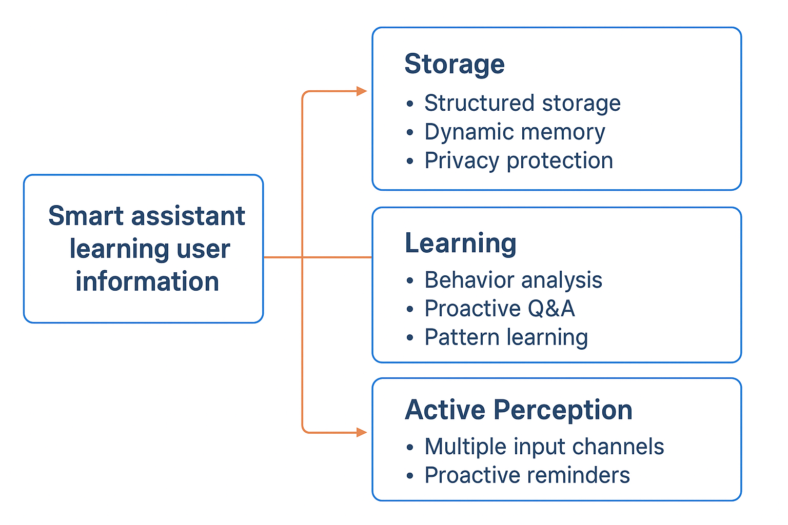

# 小乐AI管家 - 智能个人助手

> **当前版本**: v0.2.0 - 轻量级语义搜索版本

基于 FastAPI + DeepSeek + PostgreSQL 的多轮对话智能助手,支持上下文记忆、会话管理、数据持久化。

## 🎯 系统架构愿景



小乐AI遵循三层智能架构设计：

1. **Storage（存储层）** - 结构化存储 + 动态记忆 + 隐私保护
2. **Learning（学习层）** - 行为分析 + 主动问答 + 模式学习  
3. **Active Perception（感知层）** - 多输入通道 + 主动提醒

**当前状态**：v0.2.0 已完成存储层基础功能，学习层和感知层处于早期阶段。

## ✨ 核心特性

- 🧠 **智能记忆系统**：PostgreSQL持久化，支持关键词搜索、时间筛选
- � **多轮对话**：完整的上下文管理，支持会话历史回溯
- 🔄 **自动重试**：API调用失败自动重试，指数退避策略
- � **详细日志**：完整的请求/响应日志，便于调试和监控
- 🌐 **Web界面**：简洁美观的聊天界面，支持会话管理和记忆查看
- 🗄️ **NAS存储**：数据存储在Synology NAS (192.168.88.188:5432)

## 🏗️ 项目结构

```
xiaole-ai/
├── main.py                  # FastAPI主服务 + REST API
├── agent.py                 # AI Agent核心逻辑 (DeepSeek/Claude)
├── memory.py                # 记忆管理系统
├── conversation.py          # 会话管理模块
├── error_handler.py         # 错误处理和重试机制
├── db_setup.py              # 数据库表结构定义
├── static/
│   └── index.html          # Web界面
├── logs/
│   └── xiaole_ai.log       # 运行日志
├── .env                     # 环境变量配置
├── requirements.txt         # Python依赖
├── start.sh                # 一键启动脚本
└── README.md               # 项目文档
```

## 🚀 快速开始

### 1. 环境准备

```bash
# 创建虚拟环境
python3 -m venv .venv
source .venv/bin/activate  # macOS/Linux
# .venv\Scripts\activate   # Windows

# 安装依赖
pip install -r requirements.txt
```

### 2. 配置环境变量

编辑 `.env` 文件:

```bash
# AI API配置
AI_API_TYPE=deepseek              # 或 claude
DEEPSEEK_API_KEY=your_api_key_here
# CLAUDE_API_KEY=your_claude_key  # 如果使用Claude

# NAS PostgreSQL配置
DB_HOST=192.168.88.188
DB_PORT=5432
DB_NAME=xiaole_ai
DB_USER=xiaole_user
DB_PASS=your_password_here
```

### 3. 初始化数据库

```bash
python db_setup.py
```

### 4. 启动服务

**方法1：使用一键启动脚本（推荐）**
```bash
./start.sh
```

**方法2：手动启动**
```bash
.venv/bin/uvicorn main:app --reload --host 0.0.0.0 --port 8000
```

### 5. 访问服务

- 🌐 **Web界面**: http://localhost:8000/static/index.html
- 📚 **API文档**: http://localhost:8000/docs
- 🔌 **API基础地址**: http://localhost:8000

## 📖 API使用示例

### 1. 单轮对话（简单模式）

```bash
curl -X POST "http://localhost:8000/think?prompt=你好，今天天气怎么样？"
```

### 2. 多轮对话（支持上下文）

```bash
# 第一轮：创建会话
curl -X POST "http://localhost:8000/chat?prompt=你好，我叫小明"
# 返回: {"session_id": "uuid-here", "reply": "你好小明..."}

# 第二轮：继续对话
curl -X POST "http://localhost:8000/chat?prompt=我刚才说我叫什么？&session_id=uuid-here"
# AI会记得你叫小明
```

### 3. 查看会话列表

```bash
curl "http://localhost:8000/sessions?user_id=default_user&limit=10"
```

### 4. 获取会话历史

```bash
curl "http://localhost:8000/session/{session_id}"
```

### 5. 搜索记忆

```bash
# 关键词搜索
curl "http://localhost:8000/memory/search?keywords=篮球,跑步"

# 时间筛选（最近24小时）
curl "http://localhost:8000/memory/recent?hours=24"

# 统计信息
curl "http://localhost:8000/memory/stats"
```

### 6. 删除会话

```bash
curl -X DELETE "http://localhost:8000/session/{session_id}"
```

## 🔧 核心功能详解

### 1. 记忆管理 (memory.py)

```python
# 保存记忆
memory.remember("用户喜欢打篮球", tag="general")

# 关键词搜索
memories = memory.recall_by_keywords(['篮球', '运动'], limit=5)

# 时间筛选（最近24小时）
recent = memory.recall_recent(hours=24, limit=10)

# 统计信息
stats = memory.get_stats()
# 返回: {"total": 100, "by_tag": {"general": 80, "task": 20}}
```

### 2. 会话管理 (conversation.py)

```python
# 创建会话
session_id = conversation.create_session(user_id="user123", title="天气咨询")

# 添加消息
conversation.add_message(session_id, "user", "今天天气怎么样？")
conversation.add_message(session_id, "assistant", "今天晴天，温度25度")

# 获取历史（最近5条）
history = conversation.get_history(session_id, limit=5)

# 获取统计
stats = conversation.get_session_stats(session_id)
# 返回: {"message_count": 10, "created_at": "2025-01-01", ...}
```

### 3. 错误处理 (error_handler.py)

自动重试机制：
- **最大重试次数**: 3次
- **初始延迟**: 1秒
- **退避策略**: 指数退避 (1s → 2s → 4s)
- **日志记录**: 每次重试都会记录日志

```python
@retry_with_backoff(max_retries=3, initial_delay=1.0)
@handle_api_errors
@log_execution
def _call_deepseek(self, system_prompt, user_prompt):
    # API调用逻辑
    pass
```

### 4. Web界面特性

- **聊天界面**: 实时对话，支持多轮交互
- **会话管理**: 查看历史会话，快速切换
- **记忆查看**: 统计信息、关键词搜索
- **响应式设计**: 支持桌面和移动设备

## 📊 数据库设计

### memories 表
| 字段      | 类型     | 说明     |
| --------- | -------- | -------- |
| id        | Integer  | 主键     |
| content   | Text     | 记忆内容 |
| tag       | String   | 标签分类 |
| timestamp | DateTime | 创建时间 |

### conversations 表
| 字段       | 类型     | 说明                   |
| ---------- | -------- | ---------------------- |
| id         | Integer  | 主键                   |
| session_id | String   | UUID会话ID（唯一索引） |
| user_id    | String   | 用户ID                 |
| title      | String   | 会话标题               |
| created_at | DateTime | 创建时间               |
| updated_at | DateTime | 更新时间               |

### messages 表
| 字段       | 类型     | 说明           |
| ---------- | -------- | -------------- |
| id         | Integer  | 主键           |
| session_id | String   | 会话ID（索引） |
| role       | String   | user/assistant |
| content    | Text     | 消息内容       |
| created_at | DateTime | 创建时间       |

## 🛠️ 技术栈

- **Web框架**: FastAPI 0.115.5
- **数据库**: PostgreSQL 9.6 (Synology NAS)
- **ORM**: SQLAlchemy 2.0.36
- **AI模型**: DeepSeek (deepseek-chat) / Claude
- **日志**: Python logging
- **前端**: 原生HTML+CSS+JS（无框架依赖）

## 📝 日志系统

日志文件: `logs/xiaole_ai.log`

```bash
# 实时查看日志
tail -f logs/xiaole_ai.log

# 查看最近错误
grep ERROR logs/xiaole_ai.log

# 查看API调用统计
grep "开始执行" logs/xiaole_ai.log | wc -l
```

日志级别：
- **INFO**: 正常操作（API调用、数据库查询）
- **WARNING**: 警告信息（重试操作）
- **ERROR**: 错误信息（重试失败、异常）

## 🚦 状态管理

### 停止服务

```bash
pkill -f 'uvicorn main:app'
```

### 重启服务

```bash
./start.sh
```

### 健康检查

```bash
curl http://localhost:8000/
# 返回: {"message": "你好，我是小乐AI管家，我已启动。"}
```

## 🔒 NAS数据库备份

### 自动备份

1. **数据库备份脚本**: `/usr/local/bin/backup_xiaole_db.sh`
2. **定时任务**: 每天凌晨3点执行
3. **备份位置**: `/volume1/Cloud/backup_xiaole_ai/`
4. **Hyper Backup**: 每天凌晨4点同步到云端

### 手动备份

```bash
# SSH登录NAS
ssh admin@192.168.88.188

# 执行备份
sudo /usr/local/bin/backup_xiaole_db.sh
```

## � 性能优化

1. **数据库索引**: 
   - `conversations.session_id` (唯一索引)
   - `messages.session_id` (普通索引)
   
2. **连接池**: SQLAlchemy自动管理连接池

3. **API超时**: 15秒（可在agent.py中调整）

4. **记忆检索**: 
   - 优先使用最近记忆
   - 关键词搜索使用OR逻辑
   - 限制返回数量（默认8条）

## 🐛 故障排查

### 问题1: 无法连接数据库

```bash
# 检查NAS PostgreSQL服务
ssh admin@192.168.88.188
sudo -i
/usr/syno/bin/synopkg status postgresql

# 测试连接
psql -h 192.168.88.188 -U xiaole_user -d xiaole_ai
```

### 问题2: API调用失败

```bash
# 查看日志
tail -50 logs/xiaole_ai.log

# 检查API密钥
cat .env | grep API_KEY
```

### 问题3: Web界面无法访问

```bash
# 检查服务状态
ps aux | grep uvicorn

# 检查端口占用
lsof -i :8000

# 重启服务
./start.sh
```

## 📚 API文档

访问 http://localhost:8000/docs 查看完整的交互式API文档（Swagger UI）

## 🤝 开发路线图

### ✅ v0.1.0 - 基础版本（已完成）
- [x] NAS PostgreSQL持久化
- [x] 多轮对话支持
- [x] 错误处理和重试
- [x] Web界面
- [x] 会话管理
- [x] 记忆搜索和统计
- [x] 日志系统

### ✅ v0.2.0 - 语义搜索版本（已完成）
- [x] 轻量级语义搜索（TF-IDF + jieba）
- [x] 会话标题自动生成
- [x] 前端版本显示

### 🚧 v0.3.0 - Learning层初始版本（规划中）

基于架构愿景的**Learning（学习层）**功能：

#### 1. 行为分析（Behavior Analysis）
- [ ] 用户对话模式分析（活跃时间、话题偏好）
- [ ] 记忆标签自动分类优化
- [ ] 用户习惯统计面板

#### 2. 主动问答（Proactive Q&A）
- [ ] 识别未完整回答的问题，主动追问
- [ ] 定期总结用户关心的话题
- [ ] 生成个性化建议

#### 3. 模式学习（Pattern Learning）
- [ ] 高频词汇识别和同义词扩展
- [ ] 常见问题自动归类
- [ ] 用户偏好模型构建

### 🔮 v0.4.0+ - Active Perception层（未来规划）

#### 多输入通道（Multiple Input Channels）
- [ ] 语音输入/输出（TTS/STT）
- [ ] 图片上传和识别（多模态）
- [ ] 文件解析（PDF、文档）

#### 主动提醒（Proactive Reminders）
- [ ] 基于记忆的定时提醒
- [ ] 智能日程建议
- [ ] 异常行为提醒

### 🛠️ 技术优化（持续）
- [ ] 用户认证（JWT）
- [ ] 向量搜索升级（pgvector）
- [ ] Docker容器化
- [ ] 单元测试覆盖
- [ ] 智能家居集成

---

**架构对照**：当前v0.2.0专注于**Storage层**，v0.3.0将启动**Learning层**建设，v0.4.0+将实现**Active Perception层**。

## 📄 许可证

MIT License

## 📧 联系方式

如有问题，请联系：gaopeng@lekee.cc
